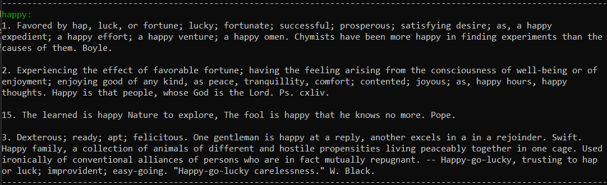

## Placeholder Image Data URL

## Install
`npm install placeholder-image-data-url`


## Usage

### Parameters
- width: `Number` : width of the image
- height: `Number` : height of the image
- color: `HEX Color` : color of the image
- text: `String` : text to display on the image

### Example
```js
// app.js
const express = require("express");
const app = express();
const port = process.env.PORT || 3003;
const getDataURL = require('placeholder-image-data-url');

const server = app.listen(port, () =>
	console.log("Server Listening on " + port)
);

app.get("/:width/:height/:text/:color", async (req, res) => {
    let width = req.params.width;  // Width of the image
    let height = req.params.height; // Height of the image
    let text = req.params.text;     // Text to be written on the image
    let color = req.params.color;  // Color of the image
    color = '#' + color;

    if (!width || !width.match(/^\d+$/)) return res.status(400).send("Width must be a number");
    if (!height || !height.match(/^\d+$/)) return res.status(400).send("Height must be a number");
    if (!color || !color.match(/^#[0-9a-f]{6}$/i)) return res.status(400).send("Color must be a hex color");

    let dataURL = await getDataURL(width, height, text, color);
    let image = Buffer.from(dataURL.split(",")[1], "base64")

    res.writeHead(200, {
        "Content-Type": "image/png",
        "Content-Length": image.length,
    });
    res.end(image);
})
```

### Output

- Access the page at `http://localhost:3003/150/150/meow/444444



## Dependencies
- [canvas](https://www.npmjs.com/package/canvas) for the image generation

## Note
- This module is not meant to be used for generating the images as image files or image response. 
- It is meant to be used for generating the image data URL.
- Look at the [example](#example) for more details on how you can generate the image as an API response.

## Keywords
- placeholder
- image
- data url
- canvas

## Enjoy 🎉
